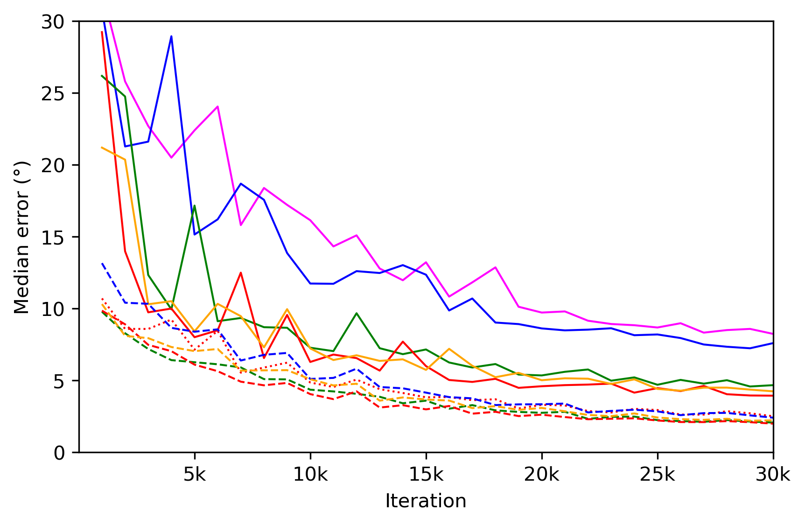
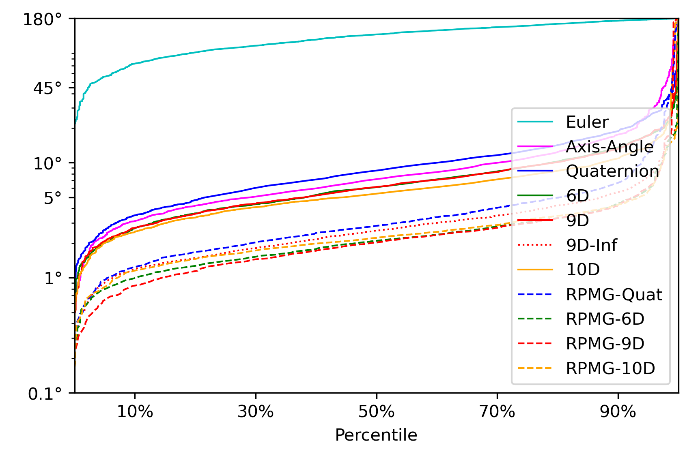
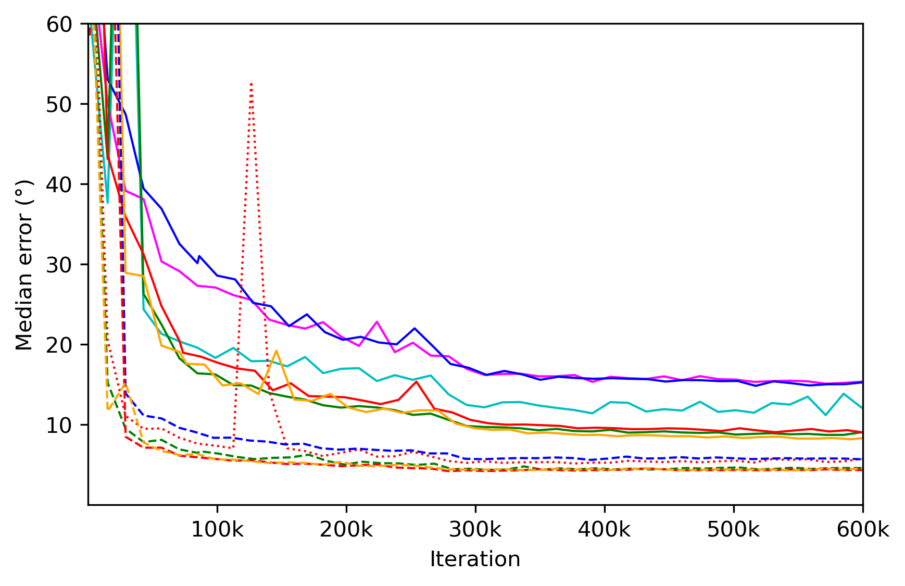
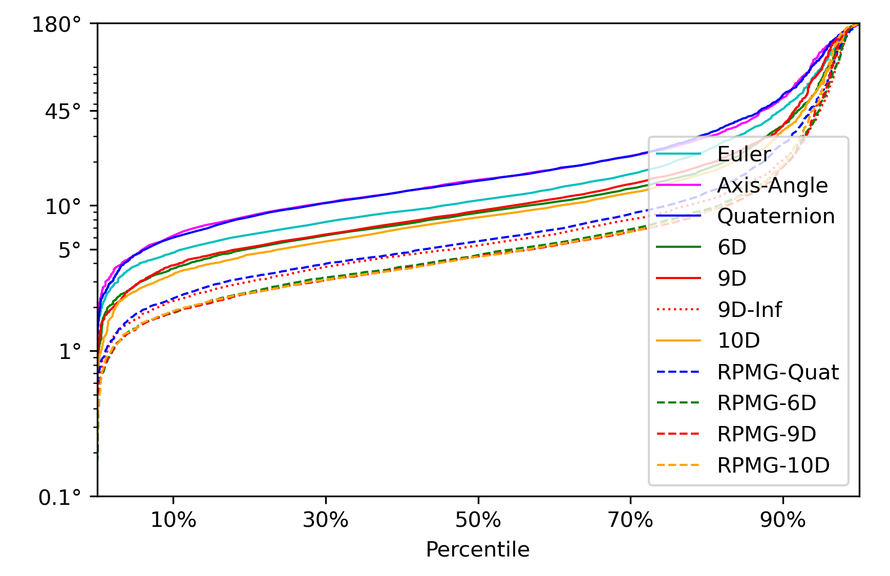
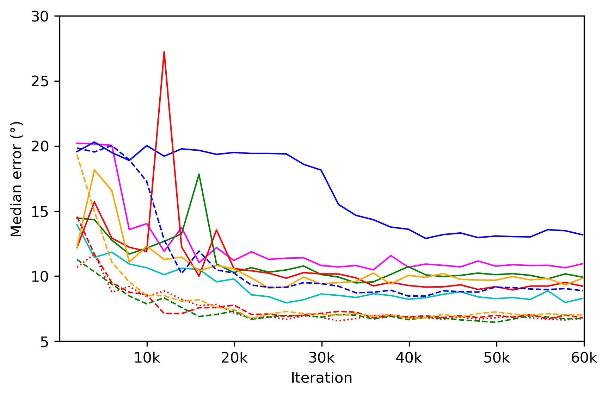
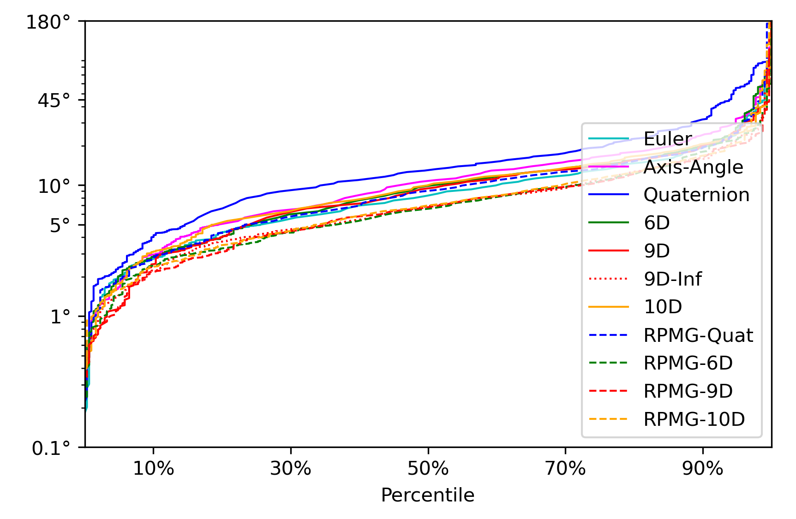

# Projective Manifold Gradient Layer for Deep Rotation Regression (CVPR 2022)

## Introduction
This project is based on our paper [Projective Manifold Gradient Layer for Deep Rotation Regression](https://arxiv.org/abs/2110.11657). For more information, you can also visit our [project page](https://jychen18.github.io/RPMG/).

## Structure
The implementation of our **Regularized Projective Manifold Gradient(RPMG)** Layer for rotation regression is in *utils/rpmg.py*. 
Since our RPMG layer is a **plug-in** module which needs to be applied to other tasks, most of our codes are revised from other public repositories on github.

To run each experiment, please see the *README.md* in each corresponding subfolder.

### 1. ModelNet_PC
3D object pose estimation from ModelNet40 point clouds developed based on [RotationContinuity](https://github.com/papagina/RotationContinuity).

<span class="center"> </span>

Left: median test error of *airplane* in different iterations during training. Right: test error percentiles of *airplane* after training completes. See the same color for comparison of w/ and w/o our RPMG layer.

For more results, please see Exp. 5.1&5.3 in our main paper and Exp. 5.3 in supplementary material

### 2. ModelNet_Img 
3D object pose estimation from ModelNet10 images developed based on [Spherical_Regression](https://github.com/leoshine/pherical_Regression).


<span class="center"> </span>

Left: median test error of *chair* in different iterations during training. Right: test error percentiles of *chair* after training completes. See the same color for comparison of w/ and w/o our RPMG layer.

For more results, please see Exp. 5.2 in our main paper.

### 4. Pascal3D_Img
3D object pose estimation from Pascal3D images developed based on [Spherical_Regression](https://github.com/leoshine/pherical_Regression).

<span class="center"> </span>

Left: median test error of *sofa* in different iterations during training. Right: test error percentiles of *sofa* after training completes. See the same color for comparison of w/ and w/o our RPMG layer.

For more results, please see Exp. 5.1 in supplementary material

### 5. poselstm-pytorch
Camera relocalization developed based on [poselstm](https://github.com/hazirbas/poselstm-pytorch).

Please see 5.2 in supplementary material

## Citation

If you find our work useful in your research, please consider citing:
```
@article{chen2021projective,
  title={Projective Manifold Gradient Layer for Deep Rotation Regression},
  author={Chen, Jiayi and Yin, Yingda and Birdal, Tolga and Chen, Baoquan and Guibas, Leonidas and Wang, He},
  journal={arXiv preprint arXiv:2110.11657},
  year={2021}
}
```

## License

 This work and the dataset are licensed under [CC BY-NC 4.0][cc-by-nc].

 [![CC BY-NC 4.0][cc-by-nc-image]][cc-by-nc]

 [cc-by-nc]: https://creativecommons.org/licenses/by-nc/4.0/
 [cc-by-nc-image]: https://licensebuttons.net/l/by-nc/4.0/88x31.png

